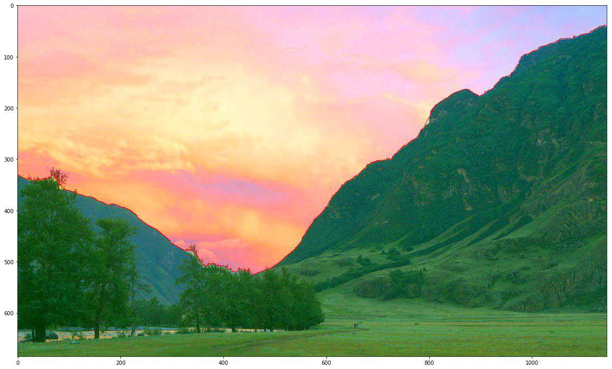
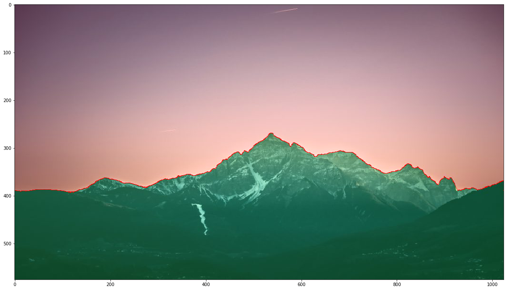

# Simple image segmentation with gradient

The main steps of my algorithm:
1. Counting image brightness
2. Calculates the gradient of all pixels in the image
3. Finding a vertical devide with minimal energy from image.
4. Display a segmented picture

## Here are two examples of the results:
<table>
<tr>
<th>Input</th>
<th>Output</th>
</tr>
<tr>
<td>

</td>
<td>

</td>
</tr>
</table>

<table>
<tr>
<th>Input</th>
<th>Output</th>
</tr>
<tr>
<td>

</td>
<td>

</td>
</tr>
</table>
